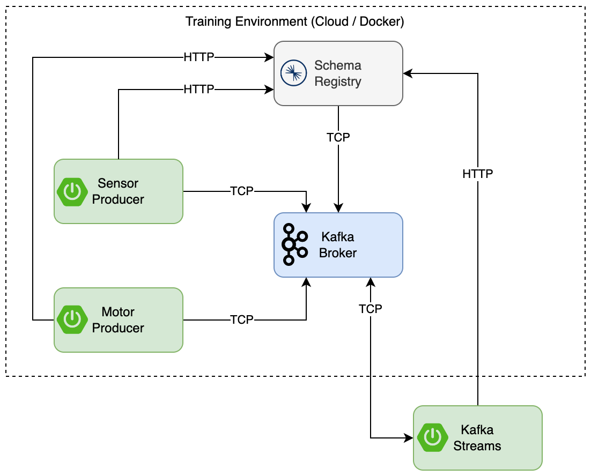

# IoT

[⬅️ Back to Kafka overview](README.md)

## Initial Setup

Start docker compose:

```
docker compose up -d
```

For the IoT use case, there are two types of containers that simulate IoT devices in a plant:

* A [sensor](uc-iot/sensor), that sends measurements in a fixed interval
* A [motor](uc-iot/motor), that sends an update if its state changes

In the [Docker Compose](docker-compose.yml) one of each is preconfigured.
If you want to configure your own sensor / motor you have the following options:

### Configure a sensor

A sensor is sending random values in a fixed interval. You can specify the interval, as well as the min and max values.

| Property           | Description                                           |
|--------------------|-------------------------------------------------------|
| SENSOR_SENSOR_ID   | ID of the sensor. Key of the kafka message            |
| SENSOR_PLANT_ID    | ID of the plant, where the sensor is from. Topic Name |
| SENSOR_INTERVAL_MS | Interval duration in ms (default: 10000)              |
| SENSOR_MIN_VALUE   | Minimal value the sensor can generate                 |
| SENSOR_MAX_VALUE   | Maximal value the sensor can generate                 |

### Configure a motor

A motor is changing its state at a random time. You can specify the states, as well as the max interval the motor will wait until sending an update.

| Property              | Description                                          |
|-----------------------|------------------------------------------------------|
| MOTOR_MOTOR_ID        | ID of the motor. Key of the kafka message            |
| MOTOR_PLANT_ID        | ID of the plant, where the motor is from. Topic Name |
| MOTOR_MAX_INTERVAL_MS | Max Interval duration in ms (default: 30000)         |
| MOTOR_STATES_0        | State of the motor (default: on)                     |
| MOTOR_STATES_1        | State of the motor (default: off)                    |
| MOTOR_STATES_2..n     | State of the motor                                   |



## Exercises

### Exercise 0: Write your first stream

Goals:

* Run your first Kafka Stream application
* Learn about different Kafka Steams Operations

Exercise:

* Open the [kafka-streams](uc-iot/kafka-stream) Spring Boot Application in an IDE (e.g. Visual Studio Code or Intellij)
* Run `mvn compile` to generate the POJOs from the Avro Schemas
* Use the template [Exercise0Stream.java](uc-iot/kafka-stream/src/main/java/com/zuehlke/training/kafka/iot/stream/Exercise0Stream.java) to implement a stream
* Play around with the different (stateless) operations
* Run the application with `mvn spring-boot:run` and check the log output

Hints:

* Use the `peek` Operation at any point in the stream to write a log output and observe the key and value of a message

Links:

* Avro Schema and maven plugin: https://avro.apache.org/docs/1.11.0/gettingstartedjava.html
* Kafka Streams Stateless Operations: https://kafka.apache.org/32/documentation/streams/developer-guide/dsl-api.html#stateless-transformations

### Exercise 1: Write alerts for high measurement values to a new topic

Goals:

* Understand Stateless Operations in Kafka Streams
* Learn how to write to Output topics

Exercise:

* Use the template [Exercise1Stream.java](uc-iot/kafka-stream/src/main/java/com/zuehlke/training/kafka/iot/stream/Exercise1Stream.java) to implement a stream
* Filter by key to only get sensor values
* Filter by values to only keep the sensor measurement of the top 20%
* Write messages to output topic

Hints:

* Have a look at the [Avro Schema](uc-iot/kafka-stream/src/main/resources/avro/values.avsc)
* The `value` field of the schema can have multiple types. In Java you have to cast the field before you can compare it:
  * `string` -> (String) measurement.getValue()
  * `long` -> (Long) measurement.getValue()
* Check the configured max values of the sensor. The default is 1 Mio

Links:

* Kafka Streams Stateless Operations: https://kafka.apache.org/32/documentation/streams/developer-guide/dsl-api.html#stateless-transformations
* Writing Streams back to kafka: https://kafka.apache.org/32/documentation/streams/developer-guide/dsl-api.html#writing-streams-back-to-kafka

Stretch Goal:

* Do the same for motors that are in the `error` state. You can do this in the same stream (checkout the `split` Operation) or in a new stream.
* Have a look at [Exercise1StreamTest](uc-iot/kafka-stream/src/test/java/com/zuehlke/training/kafka/iot/stream/Exercise1StreamTest.java). Is it green?

### Exercise 2: Add metadata to sensor message

Goals:

* Unterstand GlobalKTables and Join Operations

Preparation:

* Navigate to [Cloud AKHQ](http://myVMsIP:8080/ui/docker-kafka-server/topic) or [Local AKHQ](http://localhost:8080/ui/docker-kafka-server/topic) to create the `metadata` topic
  * Create a new topic
    * Select Button 'Create a topic'
    * Enter Name `metadata`
    * Click 'Create'
  * Add metadata to topic
    * Select topic `metadata` and click on magnifier icon
    * Select Button 'Produce to Topic'
    * Enter Key `mySensor` and value `cm`, Select 'Produce' Button
    * Enter Key `myMotor` and value `state`, Select 'Produce' Button
  
Exercise:

* Use the template [Exercise2Stream.java](uc-iot/kafka-stream/src/main/java/com/zuehlke/training/kafka/iot/stream/Exercise2Stream.java) to implement a stream
* Join the `myPlant` stream with the `metadata` table using the keys
* Expand `SensorMeasurement` value with type from `metadata`
* Write the result to a new Kafka Topic

Hints:

* `SensorMeasurement` provides a builder that can be used to set the type

Links:

* Kafka Streams Joining: https://kafka.apache.org/32/documentation/streams/developer-guide/dsl-api.html#joining

### Exercise 3 (Optional): Calculate the average value for a sensor over a 1min time frame

🔎 This is a real world exercise and can be challenging

Goals:

* Understand Stateful Operations in Kafka Streams
* Unterstand Windowing in Kafka Streams

Exercise:

* Use the template [Exercise3Stream.java](uc-iot/kafka-stream/src/main/java/com/zuehlke/training/kafka/iot/stream/Exercise3Stream.java) to implement a stream
* Filter by key to only get sensor values
* Group messages for the same sensor (= key)
* Perform a windowed aggregation with a timeframe of 1min
* Calculate the average value from the aggregated values
* Create a new `SensorMeasurement`
* Write the result to a new Kafka Topic

Hints:

* Have a look at the [Avro Schema](uc-iot/kafka-stream/src/main/resources/avro/values.avsc)
* Have a look at the Operations: `filter`, `groupByKey`, `windowedBy` and `aggregate`
* Measurement are being sent in a fixed interval of 10s

Links:

* Kafka Streams Windowing: https://kafka.apache.org/32/documentation/streams/developer-guide/dsl-api.html#windowing
* Kafka Streams Aggregation (windowed): https://kafka.apache.org/32/documentation/streams/developer-guide/dsl-api.html#aggregating

