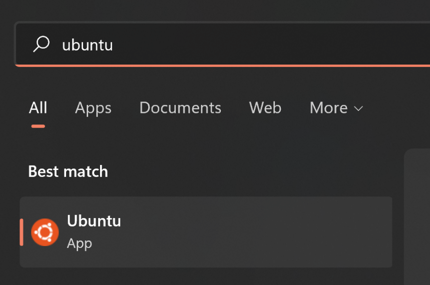
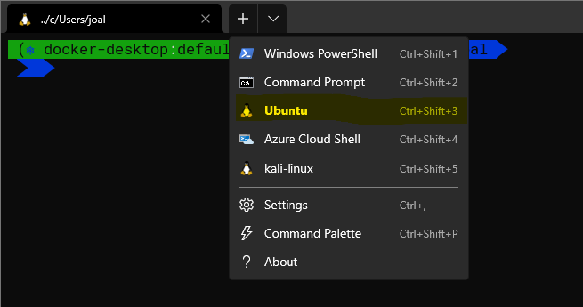
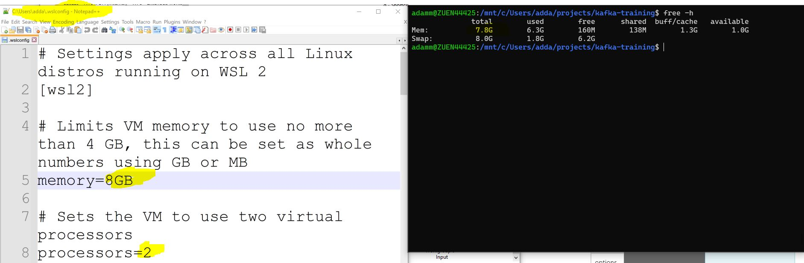
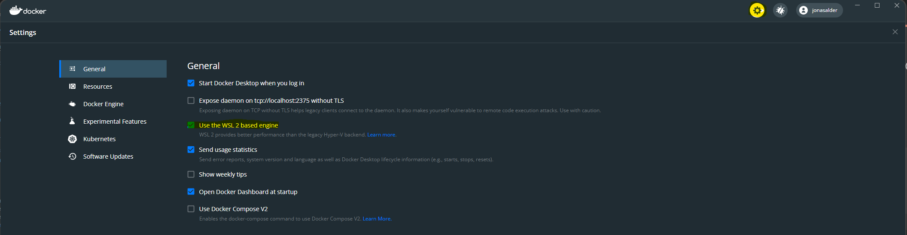
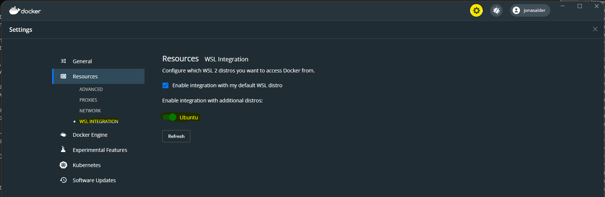
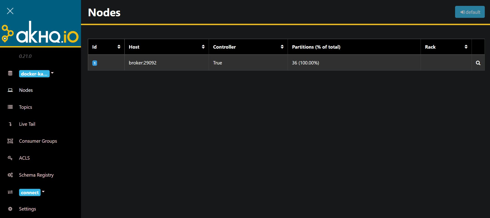

# Kafka Training Environment
[⬅️ Back to Kafka overview](README.md)

## Training environment
This training comes with a predefined environment provided in multiple docker containers. 

Services overview:
* akHQ - Manage & view data inside your Apache Kafka cluster: http://localhost:8080/
* phpMyAdmin: http://localhost:8085/ Leave the field for the server blank and type for the **username** and **password** "**kafka-training**".
* Kafka Broker: localhost on port 9092
* Kafka Zookeeper: localhost on port 2181
* Schema Registry: localhost on port 8081
* Rest Proxy: localhost on port 8082 
* Kafka Connect: localhost on port 8083
* ksqlDB: localhost on port 8088
* MariaDB: localhost on port 3306

💡 The whole environment is quite main memory intensive. We recommend a computer with at least 16 GB of working memory. 

## Technical prerequisite for the training

The following service components should be installed on your training device before attending the training. A detailed installation guide will be given afterwards. 

* Docker Desktop
* Development: 
  * VS Code (or your IDE/text editor of choice) 
  * Current Java JDK
  * Git
  * Maven
* Optional: HTTP client to send requests like Postman

In addition, required for Windows users:
* Windows Subsystem for Linux (WSL)
* Ubuntu 20.04 for WSL (recommended, other distributions might work too)
* Windows Terminal (optional, but very nice)

## Step-by-Step Guide: Preparation of Notebook for Windows Users

Enable nested virtualization
Only required if running inside a VM
https://docs.microsoft.com/en-us/virtualization/hyper-v-on-windows/user-guide/nested-virtualization

Install WSL
https://docs.microsoft.com/en-us/windows/wsl/install
In a shell with admin permissions run
wsl --install

Ensure you're running WSL 2 and not the legacy WSL 1
wsl --status
Example output
Default Distribution: Ubuntu
Default Version: 2

Windows Subsystem for Linux was last updated on 8 Nov 2021
WSL automatic updates are on.

Kernel version: 5.10.60.1

Install Windows Terminal (optional)
See https://docs.microsoft.com/en-us/windows/terminal/install
Optional but very nice to use 😊

Install Ubuntu 20.04 from the Microsoft store
See https://www.microsoft.com/store/productId/9N6SVWS3RX71 Alternative link: https://aka.ms/wslstore
You should now be able to run the Ubuntu app



or select the shell in the Windows Terminal



On first run you'll be asked to setup a user.

As a next step we recommend providing 8 GB of memory and 2 processor for your WSL environment. To achieve that create a file **.wslconfig** in your home folder and copy the content below.

https://docs.microsoft.com/en-us/windows/wsl/wsl-config#wslconfig
```
# Settings apply across all Linux distros running on WSL 2
[wsl2]

# Limits VM memory to use no more than 4 GB, this can be set as whole numbers using GB or MB
memory=8GB

# Sets the VM to use two virtual processors
processors=2

# Specify a custom Linux kernel to use with your installed distros. The default kernel used can be found at #https://github.com/microsoft/WSL2-Linux-Kernel
#kernel=C:\\temp\\myCustomKernel

# Sets additional kernel parameters, in this case enabling older Linux base images such as Centos 6
kernelCommandLine = vsyscall=emulate

# Sets amount of swap storage space to 8GB, default is 25% of available RAM
swap=8GB

# Sets swapfile path location, default is %USERPROFILE%\AppData\Local\Temp\swap.vhdx
swapfile=C:\\temp\\wsl-swap.vhdx

# Disable page reporting so WSL retains all allocated memory claimed from Windows and releases none back when free
pageReporting=false

# Turn off default connection to bind WSL 2 localhost to Windows localhost
localhostforwarding=true

# Disables nested virtualization
nestedVirtualization=false

# Turns on output console showing contents of dmesg when opening a WSL 2 distro for debugging
debugConsole=true
```

Here is an example of the configuration and the provided memory. 



Install Docker Desktop
Note: If you plan on using Docker Desktop commercially, please ensure you sign up for a paid account. 
See https://www.docker.com/products/docker-desktop

Enable WSL backend in Docker Desktop
Note: This is probably already your default if installed after WSL


Enable WSL integration in Docker Desktop
This is to enable direct access to Docker from your distribution and add the necessary binaries.



Confirm all changes to Docker Desktop with the press of “Apply & Restart”


## Step-by-Step Guide: Preparation of Notebook for Mac Users

Install Docker Desktop
Note: If you plan on using Docker Desktop commercially, please ensure you sign up for a paid account.
See https://www.docker.com/products/docker-desktop

TBD: 

## Windows & Mac: Start the training environment

Open a shell into your Ubuntu or Mac and run the following command to check out the course repository and start the environment.
```
git clone https://github.com/lfrei/kafka-training.git
cd kafka-training
docker-compose up -d
```

💡 If  Git is need to be installed on Ubuntu use the following command: 
```
sudo apt install -y git
```

Verification
To check things are up and running, execute the following command. There should be a list of running containers.
```
docker ps

Example output
CONTAINER ID   IMAGE                                        COMMAND                  CREATED      STATUS                PORTS
NAMES
a9308b57635b   tchiotludo/akhq                              "docker-entrypoint.s…"   6 days ago   Up 5 days             0.0.0.0:8080->8080/tcp
kafka-training_akhq_1
b31ceaeefe17   confluentinc/ksqldb-examples:6.2.1           "bash -c 'echo Waiti…"   6 days ago   Up 5 days
ksql-datagen
7603bc35e7a4   confluentinc/cp-schema-registry:6.2.1        "/etc/confluent/dock…"   6 days ago   Up 5 days             0.0.0.0:8081->8081/tcp
schema-registry
2c500a51d444   confluentinc/cp-ksqldb-cli:6.2.1             "/bin/sh"                9 days ago   Up 5 days
ksqldb-cli
7cbed5d931ce   confluentinc/cp-ksqldb-server:6.2.1          "/etc/confluent/dock…"   9 days ago   Up 5 days             0.0.0.0:8088->8088/tcp
ksqldb-server
83cbf549e838   ghcr.io/lfrei/kafka-training/motor:latest    "/cnb/process/web"       9 days ago   Up 5 days
kafka-training_motor_1
bea7e34ad4b8   ghcr.io/lfrei/kafka-training/sensor:latest   "/cnb/process/web"       9 days ago   Up 5 days
kafka-training_sensor_1
703cf9a5cd61   confluentinc/cp-kafka-rest:6.2.1             "/etc/confluent/dock…"   9 days ago   Up 5 days             0.0.0.0:8082->8082/tcp
rest-proxy
a7a64ae57f86   confluentinc/cp-kafka-connect:5.4.9          "/bin/bash -c '# JDB…"   9 days ago   Up 5 days (healthy)   0.0.0.0:8083->8083/tcp, 9092/tcp
kafka-connect-01
c07f7bb51a12   confluentinc/cp-server:6.2.1                 "/etc/confluent/dock…"   9 days ago   Up 5 days             0.0.0.0:9092->9092/tcp, 0.0.0.0:9101->9101/tcp   broker
431c9064af8f   phpmyadmin/phpmyadmin                        "/docker-entrypoint.…"   9 days ago   Up 5 days             0.0.0.0:8085->80/tcp
```
In addition you can visit http://localhost:8080/ and check if everything  is running appropriately.


## akHQ
Manage & view data inside your Apache Kafka ® cluster


Further information can be found on the product website https://akhq.io/


## Troubleshooting
Delete your local persistent data: 
```
docker volume rm kafka-training_db-leach kafka-training_db_conf kafka-training_db_data
```
Restart your environment: 
```
docker-compose restart
```
Stop and remove resources of your environment
```
docker-compose down
```
TBD: Logs

